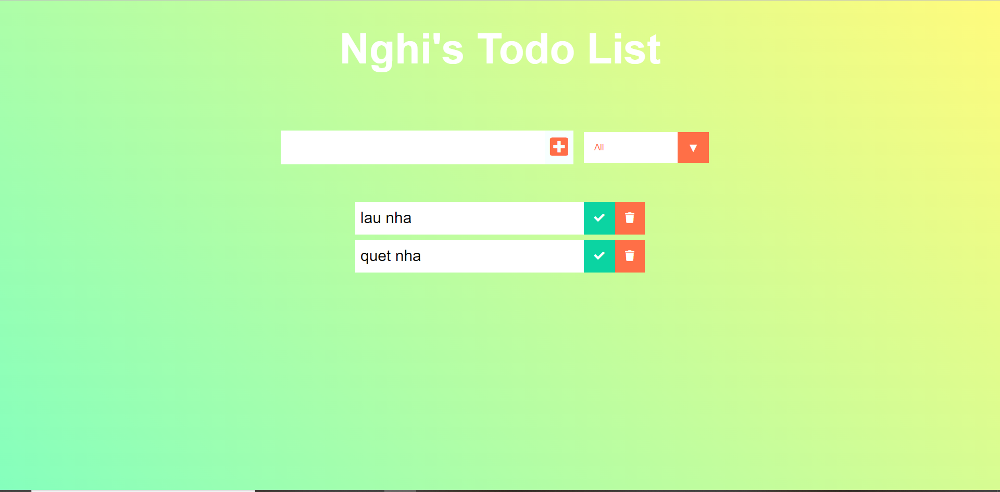

### What is this project ?

This is my first simple React project that you can create, delete and sort your todo list

<h1>How to install this Todo_list_app</h1>

1. Clone this github respository

2. Download node in: https://nodejs.org/en/

3. Open your terminal to the folder location, type: npm install

4. After that, run npm start

<h1>Technologies used for this project</h1>

React, javascript, html, css, hook

<h1>Screenshot from the app</h1>

